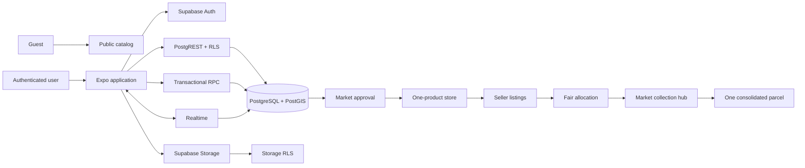
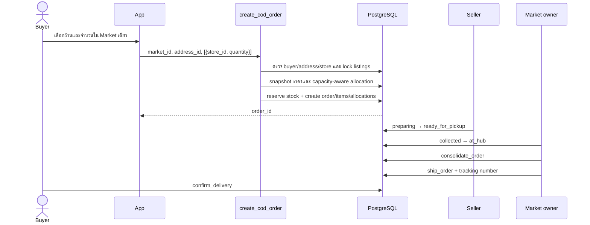
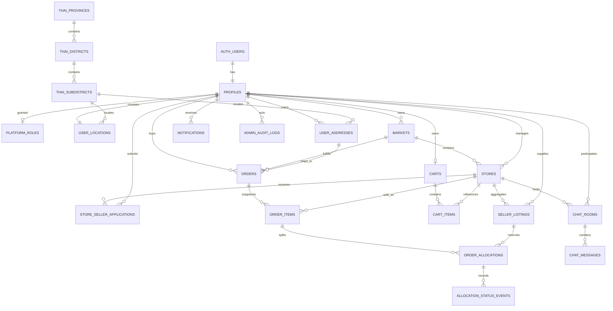
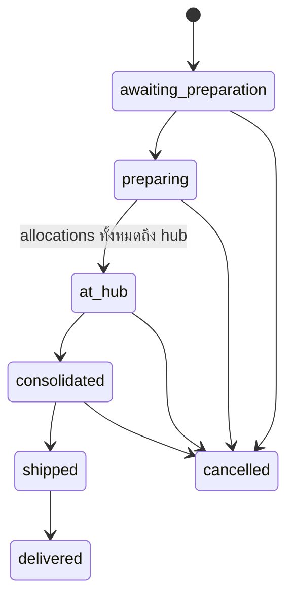

# Locomall

Locomall คือแพลตฟอร์ม Community Commerce สำหรับรวมสินค้าจากผู้ขายหลายรายใน
ชุมชนเดียวกัน โดยใช้โครงสร้างหลัก:

> Market ชุมชน → ร้านค้าหนึ่งสินค้า → ผู้ขายหลายราย → กระจายออเดอร์อย่างเป็นธรรม → รวมสินค้าที่ Market → ส่งหนึ่งพัสดุ

V1 รองรับ COD และการยืนยันด้วยคน Payment Gateway, Wallet, Review และ social
features ถูกแยกเป็น milestone หลัง Commerce Core.

## Technology stack

- React Native 0.86, React 19, Expo 57 และ Expo Router
- TypeScript แบบ strict
- Supabase Auth, PostgreSQL, PostGIS, Storage และ Realtime
- PostgreSQL RPC สำหรับ transaction สำคัญ และ RLS สำหรับ authorization
- Kanit สำหรับ UI ภาษาไทย และ Spectral สำหรับ branding
- Node test runner สำหรับ unit/contract tests

## Architecture



หลักแบ่งความรับผิดชอบ:

- Client รับ input, แสดงผล และ subscribe Realtime
- RLS ตัดสินว่าใครอ่าน/เขียน row ใดได้
- RPC ตรวจ identity, ownership, state transition และทำ transaction/row locking
- Client ไม่สามารถกำหนดราคา, seller, allocation หรือยอดรวมของ order
- `platform_roles` เป็นแหล่งสิทธิ์ Admin; ไม่ใช้ `profiles.role` หรือ user metadata

## Business roles

| Role | ความสามารถหลัก |
|---|---|
| Guest | ดู Market และร้านที่ approved |
| Buyer | ตะกร้า, COD checkout, order tracking, chat |
| Seller | จัดการ stock และเตรียม allocation ของตนเอง |
| Store manager | ดูแลร้านหนึ่งสินค้าและ chat กับ buyer |
| Market owner | อนุมัติร้าน/ผู้ขาย, รับของ, รวมและจัดส่ง order |
| Platform Admin | อนุมัติ Market, self-approval escalation และ audited override |

ผู้ใช้หนึ่งบัญชีเป็น Buyer, Seller, Store manager และ Market owner พร้อมกันได้
สิทธิ์เหล่านี้อนุมานจาก relationship; Platform Admin เป็นสิทธิ์พิเศษแยกต่างหาก.

## Commerce flow



Fair allocation เรียงผู้ขายจาก `last_allocated_at` และกระจาย capacity ใหม่เมื่อ
ผู้ขายรายใด stock ไม่พอ ตัวอย่าง canonical:

- `30 / [100,100,100] → [10,10,10]`
- `30 / [5,100,100] → [5,13,12]` หรือ `[5,12,13]` ตาม fairness cursor

## Database schema



### Table groups

| Group | Tables | Purpose |
|---|---|---|
| Identity | `profiles`, `platform_roles` | ข้อมูลผู้ใช้และ Admin role |
| Thai location | `thai_provinces`, `thai_districts`, `thai_subdistricts`, `user_locations`, `user_addresses` | cascading address, GPS consent และ discovery |
| Catalog | `markets`, `stores`, `store_seller_applications`, `seller_listings` | approval, one-product store และ stock รายผู้ขาย |
| Commerce | `carts`, `cart_items`, `orders`, `order_items`, `order_allocations` | Market-scoped cart, price snapshot และ allocation |
| History | `approval_events`, `allocation_status_events`, `admin_audit_logs` | append-only operational/audit trail |
| Communication | `chat_rooms`, `chat_messages`, `notifications` | participant-only chat และ in-app Realtime |

Business IDs ใช้ `bigint identity`; user IDs ใช้ UUID จาก `auth.users`.

### Public RPC API

- Location: `complete_location_onboarding`, `discover_nearby`
- Approval: `apply_for_market`, `review_market`, `apply_to_open_store`, `review_store`, `apply_to_sell_in_store`, `review_store_seller`
- Catalog media: `set_market_image`, `set_store_image`
- Stock/cart: `update_my_listing_stock`, `increment_cart_item`, `upsert_cart_item`, `remove_cart_item`
- Order: `create_cod_order`, `cancel_order`, `confirm_delivery`
- Logistics: `mark_allocation_ready`, `record_allocation_collected`, `record_allocation_at_hub`, `consolidate_order`, `ship_order`

Helper functions อยู่ใน private schema และไม่เปิดผ่าน Data API.

## Order state model



Allocation ใช้ `preparing → ready_for_pickup → collected → at_hub` โดยทุก transition
ตรวจ actor และเขียน `allocation_status_events`. หลังเริ่มส่ง การยกเลิกต้องใช้ Admin
override และถูกบันทึก audit log.

## Nearby discovery

- ใช้ `geography(Point,4326)` และ GiST indexes
- เริ่มค้นหาที่ 10 กม. แล้วขยาย 15, 20, ... 100 กม.
- หากยังไม่พบ คืนรายการใกล้สุดทั่วประเทศ
- จัดอันดับ radius/distance ก่อนข้อความค้นหาและ stock
- Onboarding บันทึกจังหวัด/อำเภอ/ตำบลด้วย centroid ก่อนโดยไม่รอ GPS
- เมื่อเข้าหน้าหลัก แอปขอ GPS เพื่อส่งให้ discovery เฉพาะ request โดยไม่บันทึก exact GPS; หากปฏิเสธจะใช้ centroid ตำบล
- ข้อมูลอ้างอิง: 77 จังหวัด, 928 อำเภอ, 7,364 ตำบล
- รายละเอียด provenance อยู่ที่ [`docs/thai-address-data.md`](docs/thai-address-data.md)

## Security model

- RLS เปิดบนทุกตารางใน public schema
- Guest อ่านได้เฉพาะ catalog/reference data ที่ตั้งใจเปิดเผย
- Exact GPS, phone, shipping address, roles และ audit logs ไม่ออก public query
- Privileged RPC ใช้ empty immutable `search_path`, schema-qualified references และตรวจ `auth.uid()`/ownership/state
- ไม่มี Service Role key ในแอป
- Storage จำกัด JPG/PNG/WebP ขนาดไม่เกิน 5 MB
- Storage paths: `{user_id}/...`, `{market_id}/...`, `{store_id}/...`
- Approval/Admin actions มี audit trail และต้องใช้ session `aal2` จาก TOTP MFA
- Security Advisor ไม่มี Critical/High; expected warnings อธิบายใน [`docs/security-advisor.md`](docs/security-advisor.md)

ปิด email confirmation ชั่วคราวตามขอบเขต V1 แต่ยังเปิด secure password change,
รหัสผ่านขั้นต่ำ 10 ตัวแบบตัวพิมพ์เล็ก/ใหญ่+ตัวเลข+สัญลักษณ์ และ TOTP MFA แล้ว ส่วน CAPTCHA กับ
leaked-password protection ต้องใส่ provider/เปิดใน Supabase Dashboard ก่อน production
(leaked-password protection ต้องใช้ Supabase Pro หรือสูงกว่า).

## Project structure

```text
locomall/
├─ app/                         Expo Router screens
│  ├─ (auth)/                  sign in/up, recovery, location onboarding
│  ├─ (tabs)/                  Home, Nearby, Orders, Notifications, Profile
│  ├─ admin/                   Platform Admin approval
│  ├─ market/                  catalog, application, owner approval/logistics
│  ├─ store/                   one-product store detail
│  ├─ seller/                  stock and allocation operations
│  ├─ order/                   cart, COD checkout and tracking
│  ├─ chat/                    buyer ↔ store manager room
│  └─ profile/                 profile, password and shipping addresses
├─ src/
│  ├─ components/              reusable UI and permission gate
│  ├─ constants/               Figma-derived design tokens
│  ├─ context/                 auth/session and language state
│  ├─ hooks/                   Supabase data and capability hooks
│  ├─ lib/                     Supabase, allocation and Storage helpers
│  ├─ mock/                    test/story fixtures only
│  └─ types/                   generated Database types
├─ supabase/
│  ├─ migrations/              canonical schema history
│  ├─ schema.sql               psql include entry point
│  └─ seed.sql                 idempotent Thai address seed
├─ scripts/                    DOPA extraction and seed generation
├─ tests/                      Node unit and contract tests
├─ docs/                       security, data provenance and test matrix
├─ app.json                    Expo identifiers and native permissions
└─ eas.json                    development/preview/production profiles
```

## Getting started

Requirements: Node.js 22+, npm, Expo-compatible Android/iOS environment and access
to the Supabase project.

```bash
npm install
copy .env.example .env.local
npm run typecheck
npm test
npm start
```

Set only public client configuration in `.env.local`:

```env
EXPO_PUBLIC_SUPABASE_URL=https://YOUR_PROJECT_REF.supabase.co
EXPO_PUBLIC_SUPABASE_ANON_KEY=YOUR_PUBLISHABLE_OR_ANON_KEY
```

Never place a secret/service-role key in an `EXPO_PUBLIC_*` variable.

## Database workflow

`supabase/migrations` is the source of truth. Create migrations through the CLI:

```bash
npx supabase migration new descriptive_name
npx supabase gen types typescript --project-id YOUR_PROJECT_REF --schema public
```

Regenerate Thai reference data:

```bash
python scripts/extract-dopa-centroids.py tambon.xlsx dopa-centroids.json
node scripts/generate-thai-seed.mjs <hierarchy-data-dir> supabase/seed.sql dopa-centroids.json
```

The seed uses `ON CONFLICT ... DO UPDATE` and never truncates user data.

## Testing

```bash
npm test
npm run typecheck
npm run lint -- --quiet
npx expo export --platform web --output-dir dist
npm audit --omit=dev --audit-level=high
```

The complete V1 matrix is in [`docs/test-cases.md`](docs/test-cases.md). Before a
release, run the E2E scenario with separate Admin, Market owner, Store manager,
three Sellers and Buyer accounts on Android, iOS and web.

## Release checklist

- Run migrations and regenerate TypeScript types
- Run Security/Performance Advisors and record accepted warnings
- Verify Auth production settings and redirect URLs
- Configure EAS environment variables without secret keys
- Test GPS granted/denied and all role boundaries on real devices
- Verify concurrent checkout, cancellation idempotency and consolidated shipping
- Compare key screens with Figma at common phone sizes
- Publish Privacy Policy/Terms and provide account deletion/support contact
- Confirm backup/restore procedure before onboarding a real Market

## V1 non-goals

- Payment Gateway, QR PromptPay and bank transfer
- Buyer/Seller Wallet and settlement
- Reviews/ratings
- Favorite, Follow and Share
- External push notifications

These features must not be added by weakening the COD transaction, RLS or audit
model established for Commerce Core.
